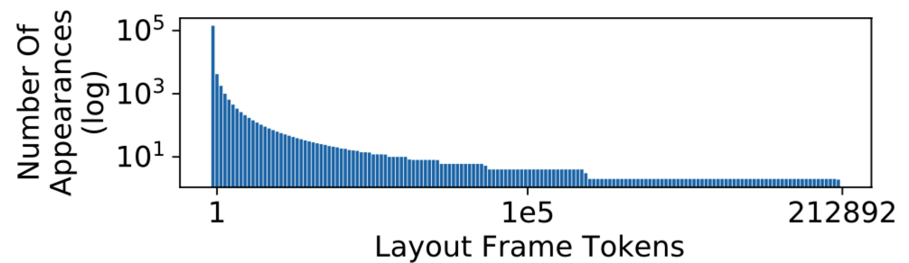

This repository is the official implementation of "[Outline, Then Details: Syntactically Guided Coarse-To-Fine Code Generation](https://icml.cc/virtual/2023/poster/25091)", accepted in ICML 2023. This work aims to improve the code generation for competitive programming problems. To better leverage the domain knowledge of programming language, we tokenize the code _not_ based on its plain string representation, but rather based on the Abstract Syntax Tree (AST). Our tokenizer decouples the code into a _syntax_-only subcomponent ($S_3$ in the paper) and a _content_-only subcomponent ($S_4$). We also use a transformer architecture that take the natural language inputs, as well as the program input/output data aligned across multiple samples according to the syntax roles.


# ✅ Quick Start

## How to only play with the proposed syntax-aware tokenizer _without loading the model_ (how to generate $S_3$/$S_4$ from code snippet):
Check out the model-independent demos in `quick_start_tokenizer.py`. The results of this file are printed in `quick_start_tokenizer_output.txt`.

If you did not get the same results as `quick_start_tokenizer_output.txt` that we provided, it is possibly due to path issue: the folder `VOCAB_22E4` are not found by python in your system. You may need to change the first 5 lines of `tokenizer/tokenization_algorithm.py`, change to absolute path so as to read the `VOCAB_SO_FILE` correctly in that file.

In `dataset_examples` folder, we provided a few example problems in the dataset (already processed by `create_data_step2_regularize.py`, which make forward passes of the I/O data into the provided code and filter out those "unfaithful" samples, and clean the code with our tokenizer). Feel free to play the examples in `dataset_examples` folder with the `quick_start_tokenizer.py` script. Different samples in one file under `dataset_examples` folder are separated by `# 🟨 🟨 🟨 🟨 ` line.


## How to load pre-trained model and run inference:
1. Download our pre-trained weights at [here](https://github.com/VITA-Group/ChainCoder/files/22169605/ckpt.zip).

2. Download the processed [CodeContest](https://github.com/deepmind/code_contests) and [APPS](https://github.com/hendrycks/apps) datasets [here](https://github.com/VITA-Group/ChainCoder/files/22149285/datasets.zip). You can optionally generate them by running `create_data_step1_tokenize_vocab_and_raw.py`, `create_data_step2_regularize.py`, `create_data_step4_SG_to_pickle.py`. See details below.

2. Clone the repo then enter the folder by `cd ChainCoder`.

3. run the following command in this folder:
`python evals.py --testing_load_ckpt_from=/your/model/weights/dirname`


## Steps to train new model from scratch
In order to run training script, you'll need to have the training data of [CodeContest](https://github.com/deepmind/code_contests) and [APPS](https://github.com/hendrycks/apps) on your disk. You can optionally generate them by running `create_data_step1_tokenize_vocab_and_raw.py`, `create_data_step2_regularize.py`, `create_data_step4_SG_to_pickle.py`.


The script to run the trianing code is `python train.py`. The training/evaluation parameters are configured in `parsers.py`. Important parameters to pay attention to:

- `--pickle_data_root`: the dataset folder. There should be one or more folders named 'difficulty_introductory', 'difficulty_competition', etc., under this folder. Required for both training and testing.

- `--training_ckpt_dump_path`: periodically save training ckpts. Required only for training. 

- `--run_on_cpu`: set to False to use cuda.


# A quick glance of the algorithm

In this work, we propose to improve the generalization and performance for competitive programing synthesis, i.e., generating code for code challenge/competition style problems. We focus on generating the python language based solution. These problems specify inputs and outputs, which can be integers, strings, lists, floats, or bool values. We propose a novel tokenizer, together with a transformer architecture to achieve this goal. Our method is featured by:

(1) Our method Tokenize the python code not out of the plain string representation, but out of Abstract Syntax Tree (AST). In this way, we can decouple the code into _syntax_ component and _content_ component (mentioned as $S_3$, $S_4$ in the paper respectively).

(2) Our method generate a shorter summary of $S_1$ and $S_2$ out of $S_3$ and $S_4$, to compose a hierarchical coarse-to-fine generation regime to facilitate the inference.

(3) In the input side, the model uses a cross-sample alignment step to encode the I/O data, which aligns different samples according to their syntax roles. 


These tokenization related steps are implemented in `tokenizer/tokenization_algorithm.py`, and further wrapped in `tokenizer/tokenizerAPI.py`. The `tokenizer/python_syntax.py` and `tokenizer/astunparse` (modified from an [existing package](https://pypi.org/project/astunparse/)) provides helper functions to convert between python code and Abstract Syntax Tree (AST). The implementations in `tokenizer/python_syntax.py` are closely tied to AST, and the corresponding python version is 3.8 at the time of implementation. Different python versions have slight differences on how the AST understands the code. If you use a different python version than python 3.8, the AST will look slightly different, and you'll need to modify `tokenizer/python_syntax.py` for a perfect support, though such modifications are easy to implement.


# 📋 Complete guidlines to the code 

By default, you should be able to succesfully run our code if your current dir is this folder (e.g., `/Users/xxx/.../ChainCoder`). However, our implementation requires two important paths to be configured correctly: the _vocabulary_ and the _dataset_. If you are having issue running our code, please check this section below.


## Why is "_vocabulary_" important when running our code?


The ChainCoder tokenizer is syntax-aware, as it is built on a unique set of syntax vocabularies drawn from the Abstract Syntax Tree (AST) of the code. To make the token sequence shorter, we applied a grouping technique to combine several adjacent syntax roles into one single token. Therefore, theoretically, the combinatorial syntax roles can become infinite, though most combined syntax roles are quite rare. Check the figure 3 of the paper below.



This means that if you want a perfect support of all syntax roles of a new dataset, you need to first do a "sweep" for this dataset to collect all necessary syntax and content patterns. We have already sweeped across the APPS and code contest datasets, and provided their syntax vocabularies in `VOCAB_22E4` folder. These vocabularies will be imported in `tokenizer/tokenization_algorithm.py`. If you want to work with a new dataset and you do not sweep for that dataset, our tokenizer API might be able to tokenize most but not all of codes in that dataset. However, even for the code snippet that cannot be perfectly tokenized due to lack of syntax token support, there exists other ways to write the code in the correct logic but different syntax, which are supported by the existing vocabularies. Therefore, the model will still be able to solve the problem. 

## How to make sure you load the "_vocabulary_" correctly?
The we have sweeped the CodeContests and APPS datasets to collect the vocabulary in the folder `VOCAB_22E4`. The path to `VOCAB_22E4` is globally configured in one place: the beginning of `tokenizer/tokenization_algorithm.py`. Please make sure you can have `os.path.exists(VOCAB_SO_FILE)==True` within `tokenizer/tokenization_algorithm.py`. If not, try to use an absolute path for `VOCAB_ROOT` in `tokenizer/tokenization_algorithm.py`.


## How to reproduce results from scratch?
The entire stages of training ChainCoder from scratch are: first collect vocabulary using `create_data_step1_tokenize_vocab_and_raw.py`, then run data augmentation using `create_data_step2_....py`, `create_data_step2_....py`, where step2 is optional. Lastly, train the model using `train.py`. Detailed steps:


### 1. Sweep across entire dataset to collect vocabulary.
This step will create a raw data folder, containing the string format code, the readable format code, the string format I/O data and the readable format I/O data.
#### 📋 checklist:
- 📋 In `tokenizer/tokenization_algorithm.py`, set VOCAB_ROOT to non-existent dir on your machine: the four vocabulary files will be saved and updated within that dir.
- 📋 Run: `create_data_step1_tokenize_vocab_and_raw.py  --STTD_root_dir=some/new/path/where/raw/files/are/dumped/into --apps_data_root=where/you/store/APPS/data/downloaded`, where the args.STTD_root_dir to non-existent dir on your machine: this will be the location where all the processed files are stored. APPS download are available [here](https://github.com/hendrycks/apps).


2. Convert from raw data to the pickle file.
2.1. (Optional) Convert from raw data to the I/O augmented data


3. (Optional) Convert from raw file to code augmented data.

4. API provided for training. This API will read from the pickle folder.


# Requirements
Since our syntax tokenizer is deeply tied with the AST package (Abstract Syntax Tree), and the AST fundamental class might change name and/or arguments whenever there are python version updates, we have some loose requirements for the Python version. The python versions that have passed our tests include:

python 3.8.13

The python versions that has failed our tests include:

python 2.x

python 3.7

If your python version is not already python 3.8, The easist way is to install a new environment with python 3.8. You can do this via `conda env create -f py38.yml`, or initialize an empty env and install torch. We require no special packages that is hard to deal, all packages except torch can simply be robustly installed via `pip install xxx`.

If you would like to try to run the syntax tokenizer or the model under other python version, or if you need to develop syntax tokenizer to encode other programming language data, you can easily do so via changing the `python_syntax/python_syntax.py`. This file defines the syntax classes needed for the `python_syntax/tokenization_algorithm.py`. The class name and arguments in the `python_syntax/python_syntax.py` exactly match the core classes in the python AST package.


# Citation

```
@article{zheng2023outline,
  title={Outline, then details: Syntactically guided coarse-to-fine code generation},
  author={Zheng, Wenqing and Sharan, SP and Jaiswal, Ajay Kumar and Wang, Kevin and Xi, Yihan and Xu, Dejia and Wang, Zhangyang},
  journal={arXiv preprint arXiv:2305.00909},
  year={2023}
}
```

