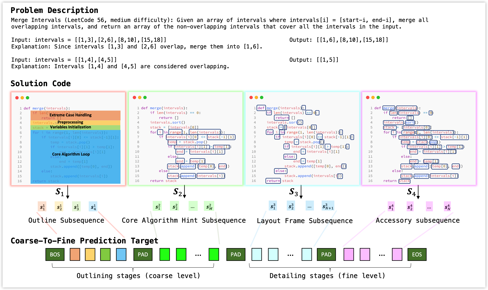

# ChainCoder
[ICML 2023] "Outline, Then Details: Syntactically Guided Coarse-To-Fine Code Generation", by Wenqing Zheng, S P Sharan, Ajay Kumar Jaiswal, Kevin Wang, Yihan Xi, Dejia Xu, and Zhangyang Wang.

Code is comming soon.




# Usage


The Syntax aware transformer is built on a unique set of vocabularies. 

This means whenever one needs to train/evaluate on a new dataset, one needs to first do a "sweep" for this dataset to collect all necessary syntax and content patterns. 

We have provided the vocabulary generated while sweeping across the APPS and code contest datasets. The code in these two datasets read from and output to the standard input/output, which has the format of

```
x = input()
# ...
y = some_functionality(x)
# ...
print(y)
```

If you have a new dataset that take the form of 
```def func(x):
    # ...
    return y
```
or other forms of the coding style significantly different, then you will need to run the vocabulary collection stage again. Otherwise, feel safe to use the vocabulary from STTD (APPS + code contest).


# ✅ Quick Start

## Steps to load pre-trained model
1. Download our pre-trained weights at: xxxx
2. run the following command in this folder:

`python evaluate.py`

## Steps to train new model from scratch

`python train.py`


# 📋 Complete steps to reproduce results from scratch

The entire stages of training ASTer from scratch are: first collect vocabulary using `sttd_step1_tokenize_vocab_and_raw.py`, then run data augmentation using `sttd_step2_....py`, `sttd_step2_....py`, where step2 is optional. Lastly, train the model using `train.py`. Detailed steps:


## 1. Sweep across entire dataset to collect vocabulary.
This step will create a raw data folder, containing the string format code, the readable format code, the string format I/O data and the readable format I/O data.
### 📋 checklist:
- 📋 In `tokenizer/tokenization_algorithm.py`, set VOCAB_ROOT to non-existent dir on your machine: the four vocabulary files will be saved and updated within that dir.
- 📋 Run: `sttd_step1_tokenize_vocab_and_raw.py  --STTD_root_dir=some/new/path/where/raw/files/are/dumped/into --apps_data_root=where/you/store/APPS/data/downloaded`, where the args.STTD_root_dir to non-existent dir on your machine: this will be the location where all the processed files are stored. APPS download are available [here](https://github.com/hendrycks/apps).


2. Convert from raw data to the pickle file.
2.1. (Optional) Convert from raw data to the I/O augmented data


3. (Optional) Convert from raw file to code augmented data.

4. API provided for training. This API will read from the pickle folder.

# Requirements
Since our syntax tokenizer is deeply tied with the AST package (Abstract Syntax Tree), and the AST fundamental class might change name and/or arguments whenever there are python version updates, we have some loose requirements for the Python version. The python versions that have passed our tests include:

python 3.8.13

The python versions that has failed our tests include:

python 2.x

python 3.7

If your python version is not already python 3.8, The easist way is to install a new environment with python 3.8. You can do this via `conda env create -f py38.yml`, or initialize an empty env and install torch. We require no special packages that is hard to deal, all packages except torch can simply be robustly installed via `pip install xxx`.

If you would like to try to run the syntax tokenizer or the model under other python version, or if you need to develop syntax tokenizer to encode other programming language data, you can easily do so via changing the `python_syntax/python_syntax.py`. This file defines the syntax classes needed for the `python_syntax/tokenization_algorithm.py`. The class name and arguments in the `python_syntax/python_syntax.py` exactly match the core classes in the python AST package.


# Citation

```
Comming soon.
```

